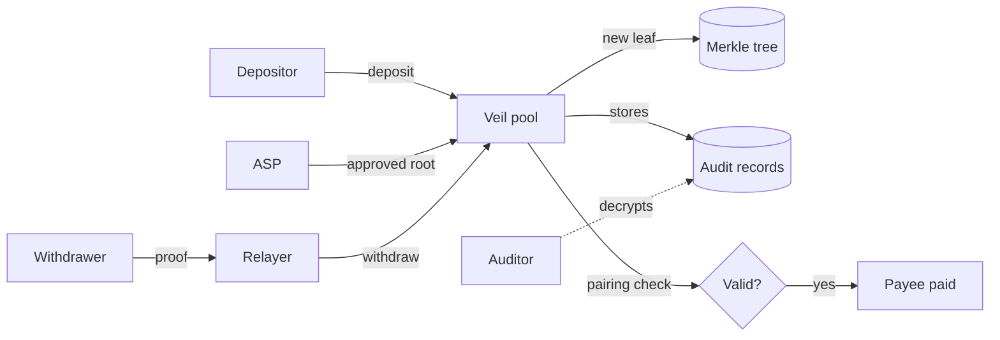
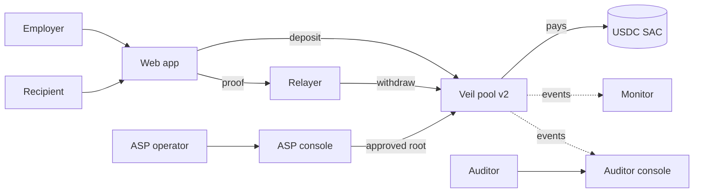

# Veil: Technical Architecture

Veil is a compliant privacy pool for payments on Stellar. People deposit into a
Soroban contract and later withdraw to a fresh address that cannot be linked to
the deposit. Every withdrawal carries a zero-knowledge proof that the money came
from an approved set of depositors, and every deposit leaves an encrypted record
that only a designated auditor can open.

This document covers two things:

1. **The system that exists today**, live on Stellar testnet.
2. **The work this SCF Build Award would fund**, which is all new work and all
   delivered on Stellar testnet.

**Scope:** every deliverable in this plan is built, deployed and tested on
Stellar testnet. Mainnet deployment is not part of this award.

---

## 1. What exists today (live on testnet)

| Item | Detail |
|---|---|
| Contract | `CCXOIBSGTXVYDWY6RBLVAVNYERHGLKAE4UCU73CEBXGUUNP622WHHWLI` |
| Private payout | [withdraw tx `1cb5e2ac…`](https://stellar.expert/explorer/testnet/tx/1cb5e2ac9eb87225977fe6552b14bf32936a55767116b4a7e6c384bcad4794cb) |
| Browser check, no wallet | [veil-zk.vercel.app/console.html](https://veil-zk.vercel.app/console.html), all four checks passing on testnet protocol 29 (3 October 2026) |
| Tests | 12 contract tests: a real proof, the real tree, five attack cases |
| Circuit | Circom 2.1.9, Groth16, 10,178 constraints, Merkle depth 20 |
| Contract | Rust, `soroban-sdk` 26 with the `hazmat` feature |

A deposit carries the token, a commitment and an encrypted audit record. The
contract appends the commitment to its own Merkle tree (depth 20) and derives
the new root. The withdrawer builds a Groth16 proof off-chain and a relayer
submits it with the 8 public inputs. The contract checks it with the BN254
`pairing_check` host function, then pays the recipient and the relayer's fee
through the Stellar Asset Contract. The auditor decrypts records off-chain with
the view key.

### 1.1 The proof

One Groth16 proof (`circuits/withdraw.circom`) shows, without revealing which
deposit is being spent:

1. The prover knows `(nullifier, secret)` for a commitment
   `C = Poseidon(nullifier, secret)`.
2. `C` is a leaf of the deposits tree (`root`).
3. The same `C` is a leaf of the approved association tree
   (`associationRoot`). This is the compliance gate.
4. `nullifierHash = Poseidon(nullifier)`, so the note can be spent once.
5. The recipient, the relayer and the fee are bound into the proof.

Public inputs, in order:
`[root, associationRoot, nullifierHash, recipientHi, recipientLo, relayerHi, relayerLo, fee]`

### 1.2 How Stellar is used today

| Stellar feature | How Veil uses it |
|---|---|
| **BN254 host functions** (`env.crypto().bn254()`, Protocol 26) | The Groth16 check runs inside the contract as a single `pairing_check`, with `vk_x` built from `g1_mul` and `g1_add`. The contract pays nothing unless the proof verifies. |
| **`poseidon_permutation` host function** (`CryptoHazmat`) | The contract builds the deposits Merkle tree itself. It feeds the host permutation circomlib's own BN254 constants, so contract and circuit agree on every node. The `poseidon_matches_circomlib` test checks this against circomlibjs vectors. |
| **Stellar Asset Contract (SAC)** | The pool holds a SAC token. Deposits use `transfer` into the contract and withdrawals pay the recipient and the relayer from it. Any Stellar asset with a SAC works, including USDC. |
| **`Address` (G and C types)** | A Stellar address is a type byte plus 32 bytes, which is more than one field element. Veil carries it as two limbs and the contract rebuilds them from the `Address` it is about to pay, then compares byte for byte. A proof cannot be redirected to another payee (Error #9). |
| **Contract errors** | Twelve typed errors, so a rejection says exactly why: unknown root (#3), spent note (#4), wrong association root (#5), invalid proof (#6), non-canonical input (#8), recipient mismatch (#9), relayer mismatch (#10), fee too large (#12) and others. |
| **Soroban RPC `simulateTransaction`** | The public console runs real contract calls through simulation, so anyone can check the deployment without a wallet or a key. |

### 1.3 Measured limits

- One deposit costs **21.3M CPU instructions** against the 100M
  per-transaction limit, and about 725 KB of memory. The test
  `deposit_fits_in_transaction_budget` guards this.
- The tree keeps a **64-root history**, so a proof built against a recent root
  still verifies after new deposits land.

### 1.4 Known limits this award addresses

These come from reading our own code, and each one maps to a deliverable below.

1. **Audit records are trusted, not proven.** A depositor could publish an
   encrypted record that does not match their note. The encryption is
   field-aligned so this can be enforced in a circuit, but it is not enforced
   yet.
2. **Storage will not scale.** All commitments and all audit records sit in two
   growing vectors, each stored as a single persistent ledger entry and
   rewritten on every deposit. Cost grows with every deposit, and a ledger entry
   has a hard size cap.
3. **No state-archival policy.** The contract never extends the TTL of its
   entries. On Stellar, an entry whose TTL runs out is archived, and any call
   that touches it has to restore it first. That adds cost and a failure path to
   every deposit or withdrawal that hits an archived tree, root history,
   instance or nullifier entry.
4. **No usable front end.** Today you need the CLI and Node scripts to deposit
   or withdraw.
5. **Single-contributor trusted setup.** Anyone who kept the setup randomness
   could forge proofs.
6. **The pool runs on test XLM**, not on testnet USDC.
7. **The association set and the auditor are scripts**, not tools that an
   operator or a compliance officer could actually run.

---

## 2. Target architecture (end of this award, on testnet)

Everything in this picture runs on Stellar testnet. There is one pool instance
per USDC denomination. The web app, the relayer and both consoles share one
client library, which is published on npm as **veil-sdk** in tranche #3.

### 2.1 Contract v2

- **Deposit proof for audit records.** A second circuit, `deposit.circom`,
  proves that the published ciphertext encrypts the depositor's identity tag and
  the note's nullifier to the auditor's public key, and that it belongs to the
  commitment being deposited. `deposit` verifies this proof on-chain using the
  same BN254 `pairing_check` path, with a second verifying key. After this, the
  auditor's ability to trace a payout is guaranteed by the proof system instead
  of by depositor honesty.
- **Scalable storage.** Commitments and audit records move out of the two
  growing vectors. Each deposit emits a contract event carrying its leaf index,
  commitment and ciphertext, and keeps only what the contract itself needs (the
  filled subtrees, the root history and one entry per nullifier). Clients and
  the auditor rebuild the tree from events through Soroban RPC `getEvents`.
  Deposit cost becomes flat instead of growing with every deposit.
- **State-archival policy.** The contract extends the TTL of its instance and
  tree entries on every deposit and withdrawal, and writes nullifier entries
  with a long TTL. Nullifiers stay in persistent storage, which Stellar archives
  but never deletes, so a spent note can never read as unspent. Tests cover a
  deposit and a withdrawal after the ledger has advanced past the old TTL, and
  the restore procedure is documented for operators.
- **USDC denominations.** The pool is deployed once per fixed denomination of
  testnet USDC (for example 10, 100 and 1,000 USDC). Fixed sizes keep amounts
  from linking deposits to withdrawals, and they avoid range proofs.
- **Typed events** for every deposit, withdrawal and association-root change,
  so the monitor and the auditor read the chain directly.

### 2.2 Relayer service

A fresh recipient wallet holds no XLM, so it cannot pay the transaction fee for
its own withdrawal. The relayer receives the proof over HTTP, simulates the
`withdraw` call, submits it and is paid the fee that the proof already binds.
The contract already rejects a relayer that tries to swap in its own address
(Error #10). The service is open source, so anyone can run one.

### 2.3 Veil web app

- Connects to Freighter and other wallets through **Stellar Wallets Kit**.
- **Deposit:** creates the note in the browser, builds and proves the deposit
  proof, submits through the connected wallet, and offers the note as an
  encrypted backup file.
- **Withdraw:** rebuilds the tree from contract events, generates the Groth16
  proof in the browser (snarkjs in WebAssembly), and sends it through a relayer.
  The note never leaves the device.

### 2.4 ASP console

The Association Set Provider decides which deposits count as approved. The
console lets an operator approve or revoke a commitment, rebuilds the
association tree, and publishes its root with `set_association_root`. Every
change is a contract event, so the whole history of the approved set is public.

### 2.5 Auditor console

A compliance officer loads the auditor view key locally, reads the encrypted
records from contract events, decrypts them and traces any withdrawal back to
its deposit and identity tag. The key never leaves the browser.

### 2.6 Monitoring

A small indexer follows the pool through Soroban RPC. It reads successful
activity from `getEvents` and failed calls from `getTransactions`, because a
failed transaction emits no contract events. It alerts on:

- an association-root change,
- a spike in withdrawals,
- a contract entry whose TTL is close to expiry,
- any failed `withdraw` with a security error (#3, #4, #6, #8, #9, #10),
- any difference between the indexer's rebuilt root and the contract's `root()`.

The threat model and the monitoring plan are written as one document and
published in this repository.

### 2.7 Multi-party trusted setup

A phase-2 ceremony over both circuits, with outside contributors. The
transcript and every contribution hash are published, and the final verifying
keys are what the testnet deployment uses. The setup stays sound as long as one
contributor discarded their randomness.

### 2.8 veil-sdk

A TypeScript package on npm that wraps note creation, proving, deposit,
withdraw, tree rebuilding from events, and audit decryption. It is the client
library the web app and the relayer already use, packaged and documented, so
integrators get the same code that runs on testnet.

---

## 3. Delivery plan (all on testnet)

| Tranche | Deliverables | How a reviewer checks it |
|---|---|---|
| **#1 MVP** | Contract v2 (deposit proof for audit records, event-based storage, TTL policy, typed events); USDC denomination pools on testnet; relayer service | New contract IDs on testnet; a deposit proof verified on-chain; a forged audit record rejected on-chain; measured deposit cost under the transaction limit; relayer-submitted withdrawal tx; tests passing from a clean clone |
| **#2 Testnet** | Veil web app; ASP console; auditor console; monitoring service; threat model and monitoring plan | Public URLs for each app; a full deposit, approve, withdraw and audit cycle done from a browser with a test wallet; monitor alerts shown firing on a staged event; threat model published in the repo |
| **#3 Final, testnet** | Multi-party trusted setup; veil-sdk on npm; testnet payroll pilot with outside testers; user testing; complete docs | Ceremony transcript and contribution hashes published; contract redeployed with the ceremony keys; package on npm; pilot report with tx links; docs site |

Every item is new work. The existing testnet deployment is the starting point
and is not billed.

---

## 4. Security model in brief

- **Soundness** rests on Groth16 over BN254 and, after tranche #3, on a
  multi-party setup.
- **Privacy** rests on fixed denominations, a large enough anonymity set, and
  relayed withdrawals so the recipient never signs a transaction linked to the
  deposit.
- **Compliance** rests on the ASP's approved set and, after tranche #1, on
  proven audit records.
- **Trusted parties, named openly:** the ASP decides who is approved, and the
  auditor can de-anonymise any payout. This is intended in a compliant pool, and
  both roles act in public through contract events.

Already fixed and covered by regression tests: redirectable withdrawals,
double-spend through non-canonical field encodings, the operator-trusted root,
and the unenforced fee. The README's
[Security section](../README.md#security-what-was-broken-and-what-fixed-it)
covers each one.

---

## 5. Out of scope for this award

- Mainnet deployment.
- Variable amounts (range proofs). Fixed denominations cover the payroll use
  case.
- Fiat on- and off-ramps. Conversion to local currency stays with existing
  Stellar anchors.
- A third-party security audit, which SCF does not fund through Build Awards.

---

## 6. How this was built

Veil is designed, directed and operated by one person, Oluwasogo Israel Ajala.
Development uses AI coding assistance (Claude Code) for writing and reviewing
code and documentation. Every claim in this document is backed by something a
reviewer can run or check: the contract tests run from a clean clone, the
deployment is on testnet, and the console calls the live contract.
